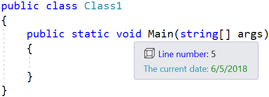

# Async Tool Window example

**Applies to Visual Studio 2017.6 and newer**

This sample shows how to provide an Async QuickInfo provider in a Visual Studio extension.

Clone the repo to test out the sample in Visual Studio 2017 yourself.



## Specify minimum supported version
Since Async QuickInfo support is new in Visual Studio 2017 Update 6, we need to specify that our extension requires that version or newer. We do that in the .vsixmanifest file like so:

```xml
<InstallationTarget Id="Microsoft.VisualStudio.Community" Version="[15.0.27413, 16.0)" />
```

*15.0.27413* is the full version string of Visual Studio 2017 Update 6.

See the full sample [.vsixmanifest file](src/source.extension.vsixmanifest).

## This sample
The code in this sample shows a tool tip (aka. QuickInfo) displaying the current line number. It uses the new `IAsyncQuickInfoSourceProvider` interface which is a simple [MEF component](https://docs.microsoft.com/en-us/visualstudio/extensibility/managed-extensibility-framework-in-the-editor).

```c#
[Export(typeof(IAsyncQuickInfoSourceProvider))]
[Name("Line Async Quick Info Provider")]
[ContentType("any")]
internal sealed class LineAsyncQuickInfoSourceProvider : IAsyncQuickInfoSourceProvider
{
    public IAsyncQuickInfoSource TryCreateQuickInfoSource(ITextBuffer textBuffer)
    {
        return textBuffer.Properties.GetOrCreateSingletonProperty(() => new LineAsyncQuickInfoSource(textBuffer));
    }
}
```

See the full [IAsyncQuickInfoSourceProvider](src/LineAsyncQuickInfoProvider.cs) in the source.


## Further reading
Read the docs for all the details surrounding these scenarios.

* [Modern Async QuickInfo API](https://github.com/Microsoft/vs-editor-api/wiki/Modern-Quick-Info-API)
* [MEF Components in the editor](https://docs.microsoft.com/en-us/visualstudio/extensibility/managed-extensibility-framework-in-the-editor)